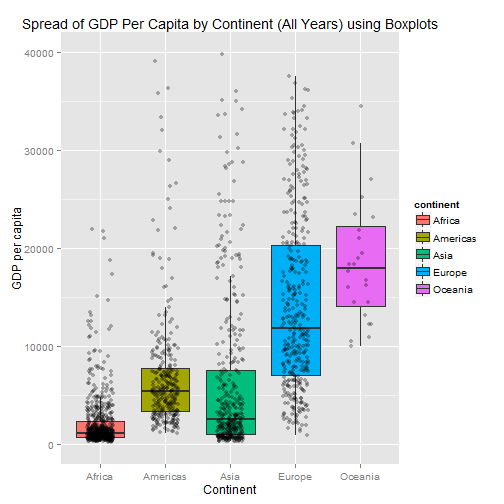

Chapter 6 - Scales, Axes, and Legends
========================================================
author: Derek and Davor
date: November 3rd, 2014
width: 1024
height: 768


6.1 Introduction
========================================================


6.2 How Scales Work
========================================================


6.3 Usage
=========

- There are default __scales__ for every aesthetic added to a plot
- Depends on variable type
    - Continuous
    - Discrete

Default Scales
==============
    


How to Add/Modify Scales
========================
- Start with `scale_`
- Follow with name of the aesthetic
    - `colour_` , `shape_` , `fill_` , `x_` , `line_` , etc.
- End with the name of the scale
    - `gradient`, `manual`, `discrete`, `continuous`

For example, if I wanted to modify the `colour` aesthetic of some `discrete` data mapped to the plot, I would type:

`ggplot(...) + scale_colour_discrete`


Example: Page 94 and 95
=======================

```r
library(ggplot2)

msleep$vore = factor(msleep$vore, 
levels = c(levels(msleep$vore), "NA"))

msleep$vore[is.na(msleep$vore)] = "NA"

p <- qplot(sleep_total, sleep_cycle, data = msleep, colour = vore)
```

***
 


Explicitly Add the Default Scale
================================

```r
p + scale_colour_hue()
```

 


Adjust Parameters: Change Appearance of Legend
==============================================

```r
p + scale_colour_hue("What does\nit eat?",
                     breaks = c("herbi", "carni", "omni", "NA"),
                     labels = c("plants", "meat", "both", "don't know"))
```

 


Use a Different Scale
=====================

```r
library(RColorBrewer)
p + scale_colour_brewer(palette = "Set1")
```

 


Axes
========================================================


Change breaks/labels
========================================================
- mention also the grid lines


Change the order of items
========================================================

 


Transformation/Formatting
========================================================


Legends
========================================================


Exercise: Remove the legend
========================================================


Exercise: Reorder items/change text
========================================================


Exercise: Position the legend
========================================================

- e.g., move the legend with the continents to the top of the graph and turn off the title
