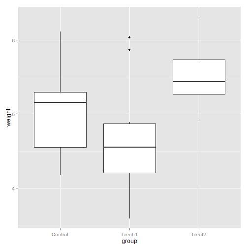
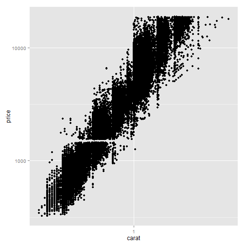

Chapter 6 - Scales, Axes, and Legends
========================================================
author: Derek and Davor
date: November 3rd, 2014


6.1 Introduction
========================================================


6.2 How Scales Work
========================================================


6.3 Usage
=========

- There are default __scales__ for every aesthetic added to a plot
- Depends on variable type
    - Continuous
    - Discrete

Default Scales
==============
    


How to Add/Modify Scales
========================
- Start with `scale_`
- Follow with name of the aesthetic
    - `colour_` , `shape_` , `fill_` , `x_` , `line_` , etc.
- End with the name of the scale
    - `gradient`, `manual`, `discrete`, `continuous`

For example, if I wanted to modify the `colour` aesthetic of some `discrete` data mapped to the plot, I would type:

`ggplot(...) + scale_colour_discrete`


Example: Page 94 and 95
=======================

```r
library(ggplot2)

msleep$vore = factor(msleep$vore, 
levels = c(levels(msleep$vore), "NA"))

msleep$vore[is.na(msleep$vore)] = "NA"

p <- qplot(sleep_total, sleep_cycle, data = msleep, colour = vore)
```

***
 


Explicitly Add the Default Scale
================================

```r
p + scale_colour_hue()
```

 


Adjust Parameters: Change Appearance of Legend
==============================================

```r
p + scale_colour_hue("What does\nit eat?", breaks = c("herbi", "carni", "omni", "NA"), labels = c("plants", "meat", "both", "don't know"))
```

 


Use a Different Scale
=====================

```r
library(RColorBrewer)
p + scale_colour_brewer(palette = "Set1")
```

 

6.4 Scale Details
=================
- Position Scales
- Colour Scales
- Manual Scales
- Identity Scale


Common Arguments
================
- `name`
- `limits`
- `breaks` and `labels`
- `formatter`


Axes
========================================================


Change breaks/labels
========================================================
- mention also the grid lines


Change the order of items
========================================================


Transformation/Formatting
========================================================


Legends
=======
- Axes and legends are collectively called `guides`.
- Read from plot, map back to original values
- Produced automatically using `scales` and `geoms`


Components of the Axes and Legend
=================================


Appearance
==========
- Breaks determine value of legend keys
- Geoms determine how keys are drawn


Merged Legends
==============
- `ggplot` tries to use fewest number of legends.
-  Will merge legends if they have same legend title


Common Tweaks
=============
- `name`: axis label and legend title
- `breaks` and `labels`: tick marks, legend keys, 
- `axis.*` and `legend.*`: visual appearance of legend
- `panel.grid.major`, `panel.grid.minor`: gridlines
- `legend.position`, `legend.justification`: location of legend


Prep for Exercise!
====================

```r
library(gapminder)
gDat <- gapminder
# gDat <- read.delim("http://www.stat.ubc.ca/~rickw/gapminderDataFiveYear.txt")
```


```r
ggplot(gDat, aes(continent, gdpPercap))+
  geom_boxplot(aes(fill = continent), outlier.shape = NA)+
  geom_jitter(alpha = 0.3, position = position_jitter(width = 0.2))+
  xlab("Continent")+
  ylab("GDP per capita")+
  ylim(c(0,40000))+
  ggtitle("Spread of GDP Per Capita by Continent (All Years) using Boxplots")
```

Base Graph
==========
 


Exercise: Remove the legend
===========================

 

Hint: Use `theme()` layer. See ?theme for details.

Exercise: Reorder Items
=======================
 

Hint: Which aesthetic is `continent` mapped to?


Exercise: Position the legend
========================================================
 

Hint: There's something else other than position changed here...
