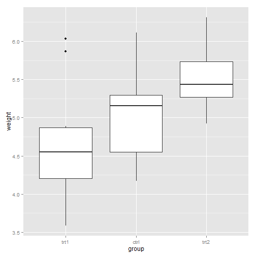

Chapter 6 - Scales, Axes, and Legends
========================================================
author: Derek and Davor
date: November 3rd, 2014


6.1 Introduction
========================================================

- Mapping data &rarr; aesthetics
  - Domain: discrete or continuous
  - Range: Ggplot aesthetics (size, colour, position, shape)
  
- Provide _guides_:
  - axes (position scales)
  - legends (colour, shape, etc.)


6.2 How Scales Work
========================================================

1. Transformation
   - e.g., log (natural, base-10, base-2) or square root
   - performed _before_ statistical summaries
   
2. Training
   - learn the domain of all the scale's layers
   - anything outside the domain is mapped to `NA`
   
3. Mapping
   - apply function to produce aesthetic values


6.3 Usage
=========

- There are default __scales__ for every aesthetic added to a plot
- Depends on variable type
    - Continuous
    - Discrete

Default Scales
==============
    


How to Add/Modify Scales
========================
- Start with `scale_`
- Follow with name of the aesthetic
    - `colour_` , `shape_` , `fill_` , `x_` , `line_` , etc.
- End with the name of the scale
    - `gradient`, `manual`, `discrete`, `continuous`

For example, if I wanted to modify the `colour` aesthetic of some `discrete` data mapped to the plot, I would type:

`ggplot(...) + scale_colour_discrete`


Example: Page 94 and 95
=======================

```r
library(ggplot2)

msleep$vore = factor(msleep$vore, 
levels = c(levels(msleep$vore), "NA"))

msleep$vore[is.na(msleep$vore)] = "NA"

p <- qplot(sleep_total, sleep_cycle, data = msleep, colour = vore)
```

***
 


Explicitly Add the Default Scale
================================

```r
p + scale_colour_hue()
```

 


Adjust Parameters: Change Appearance of Legend
==============================================

```r
p + scale_colour_hue("What does\nit eat?", breaks = c("herbi", "carni", "omni", "NA"), labels = c("plants", "meat", "both", "don't know"))
```

 


Use a Different Scale
=====================

```r
library(RColorBrewer)
p + scale_colour_brewer(palette = "Set1")
```

 

6.4 Scale Details
=================
- Position scales
- Colour scales
- Manual scales
- Identity scale


Common Arguments
================
- `name`
- `limits`
- `breaks` and `labels`
- `formatter`: now provided as `labels`


Exercises
========================================================

- We'll use the PlantGrowth dataset:


```r
bp <- ggplot(PlantGrowth, aes(x=group, y=weight)) + geom_boxplot()
```
***
 


Change breaks/labels
========================================================

- Nicer labels to the groups
- Major grid lines at integer weight
- Minor grid lines at half-points

***

 


Change the order of items
========================================================

- Order the groups 'trt1', 'ctrl', 'trt2'

***

 


Transformation/Formatting
========================================================


```r
qplot(carat, price, data = diamonds) +
  scale_x_log10() + scale_y_log10()
```

 

Exercise
========================================================

- Plot on the log10 scale
- Ticks every $10^\frac{1}{10}$-th carat
- Nice labels
- Hint: the `scales` library is useful

***

 

Legends
=======
- Axes and legends are collectively called `guides`.
- Read from plot, map back to original values
- Produced automatically using `scales` and `geoms`


Components of the Axes and Legend
=================================


Appearance
==========
- Breaks determine value of legend keys
- Geoms determine how keys are drawn


Merged Legends
==============
- `ggplot` tries to use fewest number of legends.
-  Will merge legends if they have same legend title


Common Tweaks
=============
- `name`: axis label and legend title
- `breaks` and `labels`: tick marks, legend keys, 
- `axis.*` and `legend.*`: visual appearance of legend
- `panel.grid.major`, `panel.grid.minor`: gridlines
- `legend.position`, `legend.justification`: location of legend


Prep for Exercise!
====================

```r
library(gapminder)
gDat <- gapminder
# gDat <- read.delim("http://www.stat.ubc.ca/~rickw/gapminderDataFiveYear.txt")
```


```r
ggplot(gDat, aes(continent, gdpPercap))+
  geom_boxplot(aes(fill = continent), outlier.shape = NA)+
  labs(x="Continent", y="GDP per capita",
       title="Spread of GDP Per Capita by Continent (All Years) using Boxplots") +
  ylim(c(0,40000))
```

Base Graph
==========
 


Exercise: Remove the legend
===========================

 

Hint: Use `theme()` layer. See ?theme for details.

Exercise: Reorder Items
=======================
 

Hint: Which aesthetic is `continent` mapped to?


Exercise: Position the legend
========================================================
 
